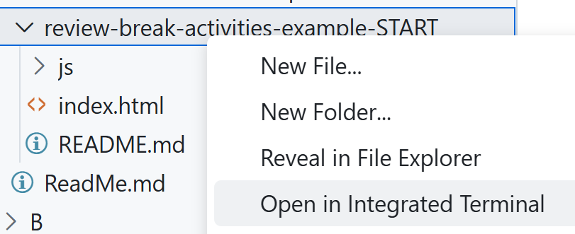

# Starter Kits

The following starter kits are for in-class and/or practice work in DMIT-2008. They are arranged according to the main topics in the Brightspace course materials.

## JavaScript Language Review

You will need to run terminal commands in the correct location. To quickly open the terminal in a demo of your workbook, right-click on the folder and choose "Open in integrated terminal".

- [Refresher - What You Remember After the Break](./review-break-activities-example-START/README.md)
- [Astronauts Example](./review-astronauts-example-START/README.md)
